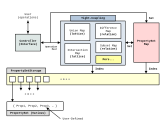
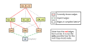

LHF Documentation and Design Document
=====================================
```
Last updated: 2025-06-28
Meant for:    Version 0.3.1
```

# Note

If you are only interested in how to apply the C++ implementation of LHF into
your program, please skip to the [Usage](#usage) section.

Information presented here is not necessarily exhaustive and it is recommended
that you go through the source code, especially if you would like to extend the
library. **If you would like to look at the API documentation, please go to the
[doxygen documentation for LHF][doxygen_doc].**

# Introduction

LatticeHashForest (LHF) is a data representation caching mechanism that is meant
to facilitate aggressive caching of redundant data, and operations performed on
such redundant data. LHF aims to reduce both the memory footprint as well as the
CPU time used by an application for every operation performed on its data when
compared to naive storage and operations on it by reducing each unique instance
of data to a unique integer identifier, and reducing the cost of performing
any bulk operation on data as much as possible.

The current LHF toolset consists of a C++ implementation of the mechanism, and
a Python script that generates an automatically set-up interface from a given
input description.

This document details the motivation, the features, and the usage of LHF, and
describes future work that needs to be done.

# Motivation

The main motivation for the creation of such a mechanism came from data-flow
analysis, a type of static program analysis where various
statically-determinable facts about a program at a given point in the program
are evaluated to find avenues of optimization.

In a naive implementation of such an analysis, data-flow values will have to be
recorded in between each basic block of a given program. This information that
is be propagated by the analysis may be redundant for various reasons, a major
one being that there has been no change in data, and the data at a later control
flow point in the traversal-order of the analysis has been unnecessarily copied
over from a previous one, costing both CPU time and memory.

Another issue is performing actual operations on the data at a given point. A
common operation, like set union if implemented without taking the proper data
structures and algorithms into consideration, can result in time complexities
equivalent or worse than `O(n^2)`.

These issues get amplified ten-fold when analyses like points-to analysis are
considered, where we determine what does a pointer variable point to. Basic
blocks can no longer be considered and data has to be instead stored across
each statement with a pointer manipulation, thus making the analysis data dense.
Moreover, when we consider an interprocedural analysis, along with control-flow
sensitivity and context sensitivity this results in a combinatorial blow up of
the information in the analysis, causing it to be not scalable.

There have been many efforts to make such analyses cheap, but with limited
success. LatticeHashForest aims to remove at the very least the trivial
redundancies, both in terms of data and operations, in order to facilitate
such situations. It provides a generalized library that can be extended to
fit processing requirements of such situations.

The second motivation for LatticeHashForest comes from experimenting with how to
group data in a way that allows for maximum caching and traditional data
structure benefits. In points-to analysis, for instance, there are multiple ways
to represent the fact that some pointer A points to some location B. One is
using a set of unique pairs representing such facts:

```
{ (A, B), (A, C), (A, D), ... }
```

Another way is to represent it as a map of pointers to a set of locations:

```
{ A -> { B, C, D }, C -> { E, F, G } }
```

Both representations allow for different benefits and drawbacks in terms of
processing, but in the second representation, if we decide to cache the set of
locations separately, thus reducing the map to a set of pairs of pointer
variables and nested, unique identifiers for sets:

```
{ (A -> 1), (C -> 2) }
```

This additional level of indirection, which we refer to as *nesting* or
*recursion* allow us to cache operations directly on the set of locations
itself. A simple change in the points-to data without a change in the set of
locations, such as to `{ (A -> 2), (C -> 1) }` in the above example, will incur
a cost of re-caching for only the points-to data, and not the entire data
represented by the set.

LatticeHashForest provides the infrastructure for exploration of such avenues
for information processing optimization and a generalized framework for
implementing such optimizations.

# Related Work

An idea very similar to the one presented here is shown in a paper from 2021
(*Mohamad Barbar and Yulei Sui. "Hash Consed Points-To Sets". In: International
Static Analysis Symposium. Springer. 2021, pp. 25–48*). It shows a very similar
mechanism to the one mentioned here, however their implementation does not
implement any form of "multilevel" caching like the way it is in LHF (described
in later sections as "nesting"), and is specific only to representing points-to
information, rather than allowing for a generalized interface for caching
records of data. The caching takes place only with the set of pointees rather
than the entire points-to set.

# General Structure of LHF

Since most of the presently available use-cases happen on aggregate values, LHF
considers a unit of data to be an aggregate of indivisible values. These
indivisible values are called *properties*, and the aggregate is called a
*property set*.

The following guarantees are given to the user by an implementation of LHF
instantiated with a given type parameter `T`:

1. Map each and every property set to a to a unique integer identifier.

2. Return the immutable concrete value of the corresponding unique identifier
   when requested.

3. Map operations on a tuple of operands like `(A, B)`, where `A` and `B` are
   the aforementioned unique identifiers, to a new unique identifier that
   represents the result of the operation.

4. All values represented by LHF, including the values generated from operations
   will be closed under `T`.

The underlying implementation employs several rules, techniques and data
structures to make the functionality efficient while maintaining the above
invariants.



The current design of LHF consists of the following components:

* **Property Sets**:

  The property sets are implemented as a vector of sorted elements, thus
  reducing an operation like a set union to an `O(n)` operation similar to the
  merge operation in merge sort.

  (Sorted vectors have been chosen over other data structures like sparse bit
  vectors in order to keep the initial implementation simple and manage
  complexity in regards to nesting, which is discussed later.)

* **Property Elements**:

  Property elements refer to the elements of property sets. Based on the
  parameters the LHF has been instantiated with, they may simply be an
  encapsulation of the property, or they may be used to enable *nesting
  behaviour* by storing unique identifiers to other sets.

* **Unique Identifiers or Indices**:

  Each property set is represented with a integer that is unique in the domain
  of each LHF. This is called the Index. The unique identifier is decided on by
  the property set storage data structure.

  The index guarantees correspondence to a unique value within the domain
  specified by the LHF instantiation, in a similar manner to how memory pointers
  guarantee correspondence to a certain location in memory.

* **Property Set Storage**:

  This is a large random-access storage data structure who's sole purpose is
  to store property sets. In its current implementation in c++, this is a
  `std::vector` of property sets. The unique identifiers are simply made to be
  an offset in the vector.

* **Map for Property Sets**:

  This is the structure responsible for mapping a given property set to its
  corresponding unique identifier. This incurs an O(n) hashing cost and
  therefore LHF is geared towards minimizing the amount of accesses to this
  map as much as possible.

* **Operation Maps**:

  Operation maps are maps specially created for hashing operations done between
  property sets such that the tuple of operands of a given operands maps to an
  identifier that represents the result of the operation. There are however
  several other considerations that are made so that we do not have to perform
  the operation at all:

  1. A special identifier is reserved for the identity (empty) property set. In
     the current implementation it is the identifier `0`.

  2. Map trivial operations (like union with an empty set, sets being equal
     etc.) automatically, without any caching.

  3. We perform any non-trivial operation with a unique tuple of operands only
     once, map the operands to the calculated identifier, and simply return the
     mapped identifier if the same operands are supplied again at any later
     point. We also store the possible tangential relations, such as subset
     relations between the operands and the result.

  4. Interrelated facts, such as subset relations between sets are stored to
     infer other relationships, such as trivial set unions or intersections.

# Deeper Implications

One particular fact that we believe the authors of the paper mentioned earlier
(*Hash Consed Points-To Sets*) did not realize is that the way they are hashing
operations (like unions and intersections) and data essentially incrementally
creates non-unique derivation trees of sets, based on the union relation, and on
merging these sets of trees, or *forests*, what we end up with is essentially
*a subset of a lattice*. Hence we are incrementally constructing lattices as the
data structure is progressively used in the analysis. These facts are used as
the namesake of this mechanism.



# Usage

*Information here may be reproduced from the earlier sections in light of the
possibility that they may be skipped.*

LHF is available as a header-only library, and can be included as follows.

```c++
#include <lhf/lhf.h>
```

An LHF can then be directly created within the user program. The following
program creates an LHF that stores sets of integers. Explanation for the types,
classes and functions used here are given later in this document.

```c++
int main() {
    // It is recommended to use type aliases wherever needed.
    using LHF = lhf::LatticeHashForest<int>;
    using Index = LHF::Index;

    LHF l;

    Index a = l.register_set({ 1, 2, 3 });
    // ...
}
```

The `lhf::LatticeHashForest` class includes all of the facilities and data
structures that have been discussed in the earlier sections. The documentation
of the API itself is available in the [doxygen documentation][doxygen_doc] or
the source code itself. Each instance of an LHF is isolated and do not share
data.

LatticeHashForests operate in terms of *sets of recursive values*. We call these
values *properties*, and the sets are called `PropertySets`. The "base-case" of
the mechanism contains no "recursive" properties and can be simply assumed to
operate on a set of values. For example, something as simple as sets of unique
integers. There are some more details in regards to how to use and retrieve data
from `PropertySets`. These are covered in a later section.

**All data retrieved from LHF is `const` and should be considered immutable,
including `PropertySets` and `PropertyElements`.**

The full template declaration of the LHF class is as follows:

```c++
template <
    typename PropertyT,
    typename PropertyLess = DefaultLess<PropertyT>,
    typename PropertyHash = DefaultHash<PropertyT>,
    typename PropertyEqual = DefaultEqual<PropertyT>,
    typename PropertyPrinter = DefaultPrinter<PropertyT>,
    typename Nesting = NestingNone<PropertyT>>
class LatticeHashForest {
     // ...
```

For a data type to be used as a property (`PropertyT`) in LHF, it must be:

* `PropertyLess`: Less-than comparable (`a < b`),
* `PropertyHash`: Hashable,
* `PropertyEqual`: Equality comparable (`a == b`), and,
* `PropertyPrinter`: Convertible to a string.

For trivial cases like `int` or `std::string`, these can be ignored entirely as
all of these traits have already been defined. However, if one wants to utilize
custom behaviour for their property type they must implement these custom traits
as either functors or within the class of the type itself.

`DefaultLess`, `DefaultHash`, `DefaultEqual` and `DefaultPrinter` are functors
that define these abilities for a given `PropertyT`. Out of these, all except
for `DefaultPrinter` follow the interface dictated by `std::less`, `std::hash`,
and `std::equal`. A user can therefore choose to define them as either explicit
functors, or operator overloads (except for in the case of `std::hash`).

`DefaultPrinter` is defined by the LHF library as follows:

```c++
template<typename T>
struct DefaultPrinter {
    String operator()(T x) {
        std::stringstream s;
        s << x;
        return s.str();
    }
};
```

Therefore, if one does not want to explicitly define a functor for string
conversion, they may simply define an operator overload for `<<` for their type.
For example:

```c++
friend std::ostream& operator<<(std::ostream& os, const PropertyT& obj) {
    os << obj.to_string();
    return os;
}
```

The above template parameters define the domain of values that can be
represented by the LHF. The template parameter `Nesting` is discussed in a later
section.

### Note on (Runtime) Instance Creation

LHF, by design, stores and deduplicates values regardless of the overarching
meaning of the data supplied to it (in other words, the "context"). This means
that a single instance of an LHF class with a given set of template parameters
is enough to store all values, and cover all use-cases within that domain of
template parameters. Hence it would make more sense to *use LHFs as static,
singleton classes*.

Whether this fact should be statically enforced may be debatable, as this might
not necessarily cover every use-case.

## Indices

Each property set is represented with a integer that is unique in the domain of
each LHF. This is called an index. An index guarantees that it uniquely
represents a certain value within the domain specified by the given LHF template
instantiation.

```c++
class LatticeHashForest {
   // ...
   struct Index {
      // ...
   };
};

class IntegerLHF = LatticeHashForest<int>;

using Index = IntegerLHF::Index;
```

### Note

Each template-instantiation of the LHF class exposes an `Index` type which is
used in all of its API functions. This statically ensures that indices belonging
to a particular LHF class do not get used in any other LHF, which can likely
cause bugs.

This however does not statically prevent two instances of the same LHF class
from exchanging indices, however this is not supposed to be a problem as there
should'nt be any special reason to use two or more instances.

## Inserting Data Into LHF

One can register a given set of properties as a member in LHF by using the
`register_set` and `register_set_single` functions. Each set is currently
defined as a **sorted vector of elements**.

```c++
using LHF = lhf::LatticeHashForest<int>;
using Index = LHF::Index;
LHF l;

Index a = l.register_set({ 1, 2, 3, 4, 9, 32, 33, 34 });
Index b = l.register_set_single(1213);
```

The values of the parameter vector, like in the above example **must be in
sorted order and without duplicates**. They can be turned to sorted order by
using the function `prepare_vector_set` which will modify the supplied vector
to match the conditions expected by `register_set`.

A runtime check for the correctness of the input is present, and will throw an
exception if the input set is found to be not in the proper form. This, of
course, incurs a runtime cost.

To disable it, you can define a macro called `LHF_DISABLE_INTEGRITY_CHECKS`
before including the LHF header, or using your build system. Behaviour of the
LHF is undefined if an unsorted set or a set with duplicates is supplied.

```c++
#define LHF_DISABLE_INTEGRITY_CHECKS
#include <lhf/lhf.hpp>
```

### Note

While `prepare_vector_set` can easily be made to be called by `register_set`
and handle this internally and hide this from the user, this allows the user
a path to come up with a better representation or algorithm to make the set
insertion more efficient instead.

## Performing Operations on Data

Operations on data registered in  in LHF accept 2 (or more) operands.

Several common operations on sets have been defined in the public API of LHF,
such as `set_union`, `set_intersection` and so on. Please refer to the API
documentation for details. In the example below, we perform the union of two
sets:

```c++
Index a = lhf.register_set({1, 9, 1213, 2222});
Index b = lhf.register_set_single(777);
Index c = lhf.set_union(a, b);

std::cout << lhf.property_set_to_string(c) << std::endl;
```

Please consult the API documentation for a full listing of operations.

## Accessing Values Within `PropertySets`

Property sets are a collection of `PropertyElements`. Currently, `PropertySets`
are sorted vectors, and follow the same interface as an `std::vector`, thus it
can be iterated on and so forth. However, it is recommended that you limit usage
the interface to the following functions because the underlying implementation
may change in the future. Please abstract away and extend the LHF class/API or
implement wrapper functions if they are required.

* Iterators (`begin()` and `end()`)
* `size()`

All property sets obtained from an LHF will be read only, as mentioned earlier.

The reason we use `PropertyElements` instead of `PropertyT` as the elements of
`PropertySets` has to do with the implementation of nesting. However, the
interface functions of `PropertyElements` are expected to be inlined and
therefore shouldn't have runtime cost associated with actually accessing and
reading the values from it.

The interface of `PropertyElement` contains the following functions (not
necessarily exhaustive):

* `get_key()`: returns the "key" value.
* `get_value()`: returns the list of values that have been nested. This is
  discussed in later sections. In the case of no nesting, however, it simply
  returns the "key" value.
* `to_string()`: Returns a string representation of the `PropertyElement`.
* Overloads for `<`, `==`: These overloads only operate on the `key` value and
  do not access the children.
* `FullEqual`: this is a functor added in to force the equality comparison of
  both the "key" and the child indices which may be required in some instances.

To illustrate the above with an example:

```c++
using LHF = lhf::LatticeHashForest<int>;
using Index = LHF::Index;
using Elem = LHF::PropertyElement;
LHF l;

Index a = l.register_set({ 1, 2, 3, 4, 9, 32, 33, 34 });

int sum = 0;

for (const Elem &e : l.get_value(a)) {
    sum += e.get_key();
    std::cout << "Adding: " << e.to_string() << std::endl;
}

std::cout << "Sum: " << sum << std::endl;
```

## Debugging, Performance Metrics and Dumping Data

The LHF implementation has some inbuilt provisions for debugging and profiling.
These can be enabled with:

* `LHF_ENABLE_DEBUG`: for debugging, and
* `LHF_ENABLE_PERFORMANCE_METRICS`: for basic profiling.

The debugging switch enables a set of runtime checks that can be used to check
the consistency of the data that is being provided to LHF, as well as internally
within LHF. It also enables blocks of statements marked as debug-only.

The metrics that are enabled by the performance metrics switch are chosen based
on their apparent usefulness for evaluation:

* `hits`: Number of direct hits (operation pair in map)
* `equal_hits`: Number of equal hits (both arguments consist of the same set)
* `subset_hits`: Number of subset hits (operation pair not in but resolvable
  using subset relation)
* `empty_hits`: Number of empty hits (operation is optimised because at least
  one of the sets is empty)
* `cold_misses`: Number of cold misses (operation pair not in map, and neither
  resultant set in map. Neither the node in lattice exists, nor the edges)
* `edge_misses`: Number of edge misses (operation pair not in map, but resultant
  set in map. Node in lattice exists, but not the edges)

Please refer to the previous (theory) sections to understand the terms used
here. However, in general higher number of hits of any category is a sign
of good cache behaviour. These metrics are calculated for every operation (like
`set_union`).

In order to present this data in a human-readable format, the member function
`dump_perf()` can be used to obtain a string representation.

To dump the entire state of the LHF, you may simply use the `dump()` member
function.

```c++
#define LHF_ENABLE_DEBUG
#define LHF_ENABLE_PERFORMANCE_METRICS
#include <lhf/lhf.hpp>

// ...
    LHF l;
    // ...
    std::cout << l.dump() << std::endl;
    std::cout << l.dump_perf() << std::endl;
    // ...
```

## Nesting

LHF's nesting mechanism allows one to build and represent complex data
structures within LHF, while still allowing to maximally utilize the caching
benefits of using LHF. Please go through the earlier (theory) sections to
understand more about this.

The way this is implemented is using the `Nesting` template parameter of LHF,
which accepts a trait-like class that contains all of the requirements for
enabling the nesting behaviour. There are two nesting trait classes that are
implemented within LHF:

### `NestingNone`

This implements the "base-case" of nesting, which is no nesting.

```c++
NestingNone<PropertyT>
```

In this case, the LHF operates in a fashion that is the same as what has been
seen until now in this document: a set storage and manipulation system.

### `NestingBase`

This implements the standard nesting behaviour.

```c++
NestingBase<PropertyT, (List of nested LHF Classes)>
```

To understand the way nesting works, let's take the example of an adjacency
list-based graph representation. Consider a graph in which each node is
represented by a unique integer, and each node has a set of outgoing, directed
edges. Here is a possible representation of one such graph:

```
{
   1 -> { 2, 5, 7, 9 },
   6 -> { 1 },
   2 -> { 7 ,9 }
}
```

What is immediately observable is that the set is a collection of pairs of a
value, and a set of values. The size of each element can increase by O(n) and
is not constant. It induces a higher cost of hashing each element, comparing
each element and storing each element. The nesting mechanism allows us the
potential to do away with this cost by caching the nested set of values that we
see in this example **into another LHF instance**.

```c++
// The LHF that stores the adjacency lists. The "child".
using AdjLists = lhf::LatticeHashForest<int>;
using AdjListIndex = AdjLists::Index;

// The LHF that stores the graph. The "parent".
using Graphs = lhf::LatticeHashForest<int,
    lhf::DefaultLess<int>,
    lhf::DefaultHash<int>,
    lhf::DefaultEqual<int>,
    lhf::DefaultPrinter<int>,
    lhf::NestingBase<int, AdjLists>>;
using GraphIndex = Graphs::Index;
```

The way the template mechanism is set up, the constructor of `Graphs` will now
ask for a reference to an instance of `AdjLists`, which is the way by which
it enables the caching of the nested sets.

```c++
AdjLists adjlists;
Graphs graphs(adjlists);
```

What happens now is that `PropertyElements` are no longer simply a wrapper
around a value, they now contain an additional list of data which are the
**indices of each of the child LHFs that have been specified for nesting.** You
may consider them to be a list of pointers, but the "pointers" in this case
represent a unique value instead of a unique memory location.

As an example of how to create property sets in this case, this recreates the
graph representation in the above example in LHF:

```c++
AdjListIndex a1 = adjlists.register_set({ 2, 5, 7, 9 });
AdjListIndex a2 = adjlists.register_set({ 1 });
AdjListIndex a3 = adjlists.register_set({ 7, 9 });

// This can be done by creating individual PropertyElements from the set or
// something else, but the most obvious construction using list initializers is
// shown here.
GraphIndex g = graphs.register_set({ {1, {a1}}, {6, {a2}}, {2, {a3}} });
```

The default behaviour specified by `NestingBase` dictates that any operation
applied to the "parent" (`Graphs`, in this case) will be applied to all of its
children (only `Adjlists`, in this case) if the "key" component (the ID of the
node for which the adjacency list is defined in this case) in an element of two
sets is the same. All of this is automatically specified using the template
mechanism.

For example, in the case of `set_union`, if we have sets `{ 1 -> A1, 2 -> A2 }`
as `G1` and `{  2 -> A3, 3 -> A2 }` as `G2`, where `An` is the Index of a set in
the adjacency list LHF, then the union of the two will be:

```
graphs.set_union(G1, G2) -->
    { 1 -> A1, 2 -> A5, 3 -> A2 }
```

Where, since the parent/key element `2` is common in both the sets, the correct
result is obtained by **recursively performing the union between the adjacency
lists, which are `A2` and `A3`**, which we assume to be `A5`. This is the same
as if we flattened the structure in to a set of edge-pairs without any nesting
instead.

If custom behaviour for nesting is needed, one may implement a custom structure
that implements the same members as `NestingNone` or `NestingBase` and use that
as the `Nesting` parameter instead. However in most cases this should not be
necessary and simply implementing a custom operation should suffice. The details
in regards to this are shown in later sections.

### Note

There is no explicit static check that enforces the requirements of the nesting
classes (`NestingNone`, `NestingBase`) due to the nature of C++ templates, and
thus are instead enforced informally in a similar fashion to interfaces in
Golang (the compiler will individually detect missing requirements from the
class.

# Extending LHF

LHF in most cases will need to be extended to fit the use-case of a particular
situation. LHF already implements several common operations within its API and
can be used as a template to implement further operations. There are a few
things and rules of thumb to keep in mind while implementing these:

## Knowledge about internal APIs

It is important that you understand the internal API of LHF to actually
implement an operation both in a manner that is correct and is efficient. The
theoretical aspects of the mechanism  detailed in the previous sections and
the doxygen/API documentation are important to understand. Here is a
(non-exhaustive) list of things to take under consideration:

* Macros for runtime checks enabled with `LHF_ENABLE_DEBUG`.
* Profiling macros enabled with `LHF_ENABLE_PERFORMANCE_METRICS`.
* How registration of sets work.
* How are operations implemented and how does caching of operations work.
* How does the subset mechanism work.
* What integrity checks are there and how they work.
* When and how are raw integers converted into the `Index` struct and back.

Please go through the earlier sections of this document, the source code and the
API documentation for the above.

## Covering Trivial Cases and Precalculated Cases

Checking these will help in increasing the performance of LHF:

* Checking whether one or both of the operands are empty.
* Checking whether operands are equal.
* Checking whether if we know one operand is a subset of the other.
* Checking whether if we already know the result of an operation (using the
  operation maps)

Only after checking the above should the operation implementation go on to
actually perform the calculation of the result of the two operands.

In essence, the general structure of an operation should look like the
following:

```c++
LHF_BINARY_NESTED_OPERATION(set_operation)
Index set_operation(const Index &_a, const Index &_b) {
    LHF_PROPERTY_SET_PAIR_VALID(_a, _b);
    __lhf_calc_functime(stat);

    // ** Handle trivial case of sets being equal **

    // ** Handle trivial case of one or both the sets being empty **

    // Ensure that the operands are in the canonical order so that they are
    // hashed only once per occurrence. We handle this by sorting them by
    // numerical value.
    // This is ONLY true for commutative operations.
    const Index &a = std::min(_a, _b);
    const Index &b = std::max(_a, _b);

    // ** Check Subset relations between sets and handle the trivial case. **

    // Check in the operation's cache if the result is already present:
    auto cursor = operation_cache.find({a.value, b.value});

    // If operation is not present:
    if (cursor == intersections.end()) {

        // ** Perform Operation (ideally O(n)) **
            // Also handle nesting cases (if present)

        // ** Register the result **

        // ** Register subset relations **

        // ** Increment performance counters **

        return Index(/* result */);
    }

    // If operation is present in the cache:

    // ** Increment performance counters **
    return Index(cursor->second);
}
```

## Implementing the Actual Operation

This refers to the actual operation that needs to be performed when none of the
trivial cases are valid and the result operation that has not been cached. It
can be implemented in any fashion. However, more often than not, a pattern like
this will be followed for its implementation since we are working with sorted
vectors. This is a very similar pattern to the merge operation of merge sort.

```c++
PropertySet new_set;
const PropertySet &first = get_value(a);
const PropertySet &second = get_value(b);

auto cursor_1 = first.begin();
const auto &cursor_end_1 = first.end();
auto cursor_2 = second.begin();
const auto &cursor_end_2 = second.end();

while (cursor_1 != cursor_end_1) { // Looping condition

    // ** Pre-branch case **

    if (less(*cursor_1, *cursor_2)) {
        // ** Not equal/less than case **
    } else {
        if (!(less(*cursor_2, *cursor_1))) {
            // ** Equal case **
            if constexpr (Nesting::is_nested) {
                // ** Nested case **
                // (We are assuming the operation is named `set_operation`)
                PropertyElement new_elem =
                    LHF_PERFORM_BINARY_NESTED_OPERATION(
                        set_operation, reflist, *cursor_1, *cursor_2);
                LHF_PUSH_ONE(new_set, new_elem);
            } else {
                // ** Non-nested case **
            }
        } else {
            // ** Not equal/greater than case **
        }
    }
}

// ** Post-loop case **
// Can be used to copy in all remaining elements from `second`
```

Note the `if constexpr` statement. This compile-time branching is essential to
the nesting implementation and cannot be replaced with macros.

Please make sure to observe the already present implementations of operations
and perform the iteration and calculation of data appropriately. The next
section discusses how the nesting mechanism is implemented in an operation.

## Enabling Nesting in an Operation

The nesting implementation abstracts away the integration into two macros:

* `LHF_BINARY_NESTED_OPERATION(operation_name)`, where `operation_name` exactly
  matches the member function name that implements the operation, and,

* `LHF_PERFORM_BINARY_NESTED_OPERATION(operation_name, reflist, arg1, arg2)`,
  where:
  * `operation_name` is the name of the operation.
  * `reflist` is the list of references to LHFs. This is already available in
    the LHF class.
  * `arg1` is the first operand.
  * `arg2` is the second operand.

`LHF_BINARY_NESTED_OPERATION` creates a special functor that is made to be the
`Operation` template argument. This is definition of the recursive operation and
will try to run the same operation as the given `operation_name` on the child
LHFs.

`LHF_PERFORM_BINARY_NESTED_OPERATION` actually executes `apply` on the current
`PropertyElements`.

The above two code examples show where and how they should be put within the
code.

Currently there are no implementations of nesting for any other arity, but they
can be added in as needed. This will require modifications to the `Nesting`
structs as well, specifically the introduction of a new `apply` member function
of `PropertyElement` that accepts more arguments.

# Programmatically Architecting Nested LHFs (Builder Tool)

The LHF project includes an additional script that allows you to automatically
generate declarations of LHF using a JSON-based description language. The files
for this are located in [`src/builder_tool`](./src/builder_tool).

The tool is currently in development and requires more testing. It may not cover
all of the possible configurations of LHF.

# Shortcomings and Future Work

The current C++ implementation of LHF does not have a way to remove objects and
free memory at the moment. Since in the current use-cases of the mechanism the
memory consumption is lower than the existing solution by design (data-flow
analysis) this was not put in as a main focus. However there is ongoing work on
automatic and semi-manual memory management in LHF.

There is also ongoing work in making LHF parallelized, allowing for multiple
readers to access the LHF at the same time and transparent workers to perform
desired manipulations in the background.

[doxygen_doc]: https://aghorui.github.io/projects/lhf/doxygen
